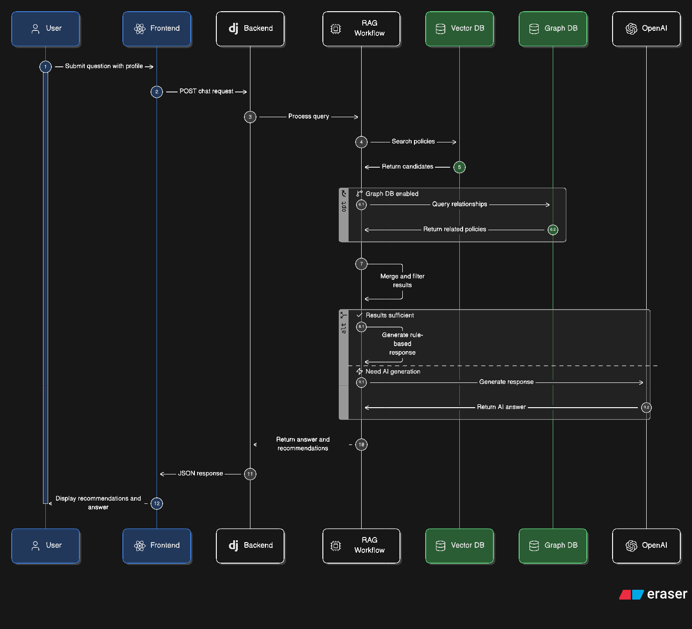

# 🧭 이젠, 안쉼 — 청년 정책 맞춤형 추천 플랫폼

> SKN 29기 4차 프로젝트 5팀  
> 청년 정책 검색부터 AI 상담, 커뮤니티, 뉴스, 영상, 알림, 마이페이지까지 한 번에 제공하는 청년 지원 정보 통합 플랫폼

- **Service URL:** `http://52.78.46.170/`
- **API Base URL:** `http://52.78.46.170/api/`
- **Admin URL:** `http://52.78.46.170/admin/`

<br />

## ✨ 프로젝트 소개

**이젠, 안쉼**은 흩어져 있는 청년 정책·지원 정보를 사용자가 더 쉽게 찾고 이해할 수 있도록 만든 웹 서비스입니다.

사용자는 정책명이나 키워드뿐 아니라 **나이, 지역, 분야, 모집 상태, 소득 조건** 등을 조합해 정책을 검색할 수 있고, AI 챗봇을 통해 자연어로 질문하며 자신에게 맞는 정책 추천을 받을 수 있습니다.

```text
“서울에 사는 25세 청년이 받을 수 있는 월세 지원 정책 알려줘”
```

이런 질문을 입력하면 시스템은 사용자 조건을 분석하고, 내부 Vector DB와 RAG 워크플로우를 통해 관련 정책을 찾아 추천 카드와 답변을 제공합니다.

<br />

## 👥 팀원 소개 및 역할 분담

<table>
  <tr align="center">
    <th width="10%">구분</th>
    <th width="18%">송민지</th>
    <th width="18%">윤승혁</th>
    <th width="18%">정승</th>
    <th width="18%">한경찬</th>
    <th width="18%">한예나</th>
  </tr>
  
  <tr align="center">
    <td><strong>사진</strong></td>
    <td></td>
    <td></td>
    <td></td>
    <td></td>
    <td></td>
  </tr>
  
  <tr align="center">
    <td><strong>역할</strong></td>
    <td><strong>Frontend Lead</strong></td>
    <td><strong>AI Backend / RAG Lead</strong></td>
    <td><strong>Data & AWS Deploy Lead</strong></td>
    <td><strong>Backend Core Lead</strong></td>
    <td><strong>PM / QA / Frontend Sub</strong></td>
  </tr>
  
  <tr valign="top">
    <td align="center"><strong>주요 담당</strong></td>
    <td>React/Vite 화면 구현, 공통 레이아웃·컴포넌트, 정책 검색·마이페이지·AI 챗봇 UX, 백엔드 API 연동</td>
    <td>Django AI Chat API, RAG/LangGraph 워크플로우 이식, Chroma/Graph 검색, 예상 지원금 계산, LLM 예외 처리, 시스템 구성도</td>
    <td>정책 데이터 적재·정제, RDS/EC2/S3 인프라, Docker Compose 배포, 마감 상태 데이터 관리</td>
    <td>Django REST API, JWT 인증·권한, 사용자/정책/커뮤니티/알림/업로드 앱, Django Admin, SMTP·S3 연동</td>
    <td>프로젝트 기획 및 산출물 총괄, 요구사항·화면설계·테스트 보고서, 뉴스·영상·보호 고지 UI 검수, QA</td>
  </tr>
</table>

<br />

## 🎯 핵심 목표

- 청년 정책 정보를 한곳에서 탐색할 수 있는 웹 서비스 구현
- React + Django 기반의 실제 배포 가능한 웹 애플리케이션 구성
- RAG/LLM 기반 AI 정책 상담 및 맞춤형 추천 기능 제공
- 인증, 권한, 커뮤니티, 알림, 마이페이지 등 사용자 기능 고도화
- AWS EC2, RDS, S3, Docker Compose 기반 배포 구조 구성
- 기능 테스트, AI/RAG 예외 테스트, 배포 검증까지 포함한 평가 산출물 완성

<br />

## 🧩 주요 기능

| 구분 | 기능 | 설명 |
| --- | --- | --- |
| 🏠 홈 | 추천 정책·정책 뉴스·인기 검색어 | 서비스 진입 화면에서 주요 정보 확인 |
| 🔎 정책 검색 | 조건 기반 정책 검색 | 정책명, 설명, 나이, 분야, 지역, 상태, 소득조건 조합 검색 |
| 📄 정책 상세 | 정책 상세 정보 확인 | 지원 대상, 신청 방법, 기간, 신청 링크, 출처 확인 |
| 🤖 AI 챗봇 | 자연어 기반 정책 상담 | 사용자 질문과 프로필 조건을 기반으로 정책 추천 |
| 👤 인증 | 회원가입·로그인·비밀번호 재설정 | 이메일 인증번호 기반 가입 및 비밀번호 찾기 지원 |
| ⭐ 스크랩 | 관심 정책 저장 | 로그인 사용자가 정책을 저장하고 마이페이지에서 관리 |
| 🧑‍🤝‍🧑 커뮤니티 | 게시글·댓글·좋아요 | 게시글 작성, 조회, 수정, 삭제 및 댓글/좋아요 처리 |
| 🔔 알림 | 활동 알림 | 좋아요, 댓글, 마감 임박 등 사용자 활동 기반 알림 표시 |
| 📰 뉴스 | 청년 정책 뉴스 | Naver Search API 프록시 기반 정책 뉴스 조회 |
| 🎬 영상 | 청년 정책 영상 | 유튜브 iframe 기반 정책·정보 영상 모아보기 |
| 🙋 마이페이지 | 개인화 관리 | 프로필 수정, 스크랩 정책, 알림, 비밀번호 변경 |

<br />

## 🗂️ 프로젝트 구조

```text
SKN29-4th-5TEAM/
├── backend/
│   ├── apps/
│   │   ├── chat_rag/          # /api/ai/chat/ AI 챗봇 API
│   │   ├── common/            # 공통 인증/예외 처리
│   │   ├── community/         # 커뮤니티 게시글·댓글·좋아요
│   │   ├── mypage/            # 마이페이지/스크랩/최근 기록
│   │   ├── news/              # Naver News API 프록시
│   │   ├── notifications/     # 알림 API
│   │   ├── policies/          # 정책 목록/상세/검색 API
│   │   ├── uploads/           # S3 프로필 이미지 업로드
│   │   └── users/             # 회원가입/로그인/JWT/이메일 인증
│   ├── config/                # Django settings / urls / wsgi / asgi
│   ├── data_pipeline/         # 정책 데이터 적재·전처리 관련 코드
│   ├── rag_engine/
│   │   ├── db/                # Vector/Graph DB 연결
│   │   ├── graph/             # LangGraph workflow
│   │   ├── prompts/           # LLM 프롬프트
│   │   ├── retriever/         # Hybrid Retriever
│   │   └── services/          # 조건 추출, 외부 검색, 답변 생성
│   └── tests/                 # 백엔드 및 AI/RAG 테스트
├── frontend/
│   ├── public/
│   └── src/
│       ├── app/               # React Router
│       ├── components/        # 공통/도메인 컴포넌트
│       ├── hooks/             # 커스텀 훅
│       ├── layouts/           # Root/Auth Layout
│       ├── pages/             # 화면 단위 페이지
│       ├── services/          # API client 및 adapter
│       ├── styles/            # 디자인 토큰/반응형 CSS
│       └── utils/             # 날짜/텍스트 포맷 유틸
├── deployment/                # dev/prod Docker Compose 및 Dockerfile
├── documents/                 # 평가 산출물 및 구현 문서
├── nginx/                     # Nginx reverse proxy 설정
├── scripts/                   # 보조 스크립트
├── docker-compose.yml         # 로컬/통합 테스트용 compose
└── requirements.txt           # RAG/데이터 분석용 루트 의존성
```

<br />

## 🏗️ 전체 시스템 구조

### 1. 평가 기준 대응 전체 시스템 구성도


### 2. AI RAG 챗봇 처리 흐름



### 3. 실제 배포 아키텍처


<br />

## 🔁 서비스 데이터 흐름

일반 API 요청은 다음 흐름으로 처리됩니다.

```text
사용자 브라우저
→ Nginx
→ React/Vite 정적 화면 제공
→ /api/ 요청 발생
→ Nginx reverse proxy
→ Gunicorn + Django REST API
→ AWS RDS PostgreSQL / Chroma Vector DB / S3 / 외부 API 연동
→ JSON 응답 반환
→ React에서 카드, 로딩, 오류, 답변 UI로 표시
```

AI 챗봇 요청은 별도의 RAG 워크플로우를 거칩니다.

```text
AI 질문
→ 요청 검증 및 사용자 프로필 정규화
→ 조건 추출
→ 도메인/source_category 라우팅
→ Chroma Vector DB 검색
→ 선택적 Graph DB 검색
→ Vector + Graph 후보 병합
→ 마감/지역/도메인/출처 후처리
→ 검색 충분성 검사
→ 신청 가능성/혜택 계산
→ Rule-based Summary 또는 LLM Answer 생성
→ 추천 카드 + 답변 + meta 반환
```

<br />

## 🛠️ 기술 스택

| 영역 | 기술 |
| --- | --- |
| Frontend | React 18, Vite, React Router DOM, Axios, lucide-react, JavaScript ES6+, HTML5, CSS3, Flex/Grid |
| Backend | Django, Django REST Framework, Simple JWT, django-cors-headers, Gunicorn |
| AI / RAG | LangGraph, ChromaDB, OpenAI API, Tavily Search, Hybrid Retriever |
| Graph 확장 | Neo4j optional |
| Data / NLP | pandas, scikit-learn, KoNLPy, JPype1, Gensim, SciPy |
| Database | AWS RDS PostgreSQL, PostgreSQL Container |
| Storage | AWS S3, boto3, Pillow |
| External API | Naver Search API, Gmail SMTP, OpenAI API, Tavily API |
| Infra | AWS EC2, Docker Compose, Nginx |
| Deployment | Nginx reverse proxy + Gunicorn + Django + React static build |

<br />

## 🚀 배포 환경

| 구분 | 현재 구성 |
| --- | --- |
| 실제 접속 URL | `http://52.78.46.170/` |
| API URL | `http://52.78.46.170/api/` |
| Admin URL | `http://52.78.46.170/admin/` |
| 공개 방식 | HTTP 80 기반 EC2 시연 |
| 운영 도메인 | 별도 도메인 미사용 |
| Docker 서비스 | `nginx`, `backend`, `db` |
| Nginx 역할 | React/Vite 빌드 결과물 정적 서빙, `/api/`, `/admin/` reverse proxy |
| Backend 실행 | Gunicorn + Django, 내부 8000 포트 |
| 실제 운영 DB | AWS RDS PostgreSQL, DB명 `youth_search` |
| Compose DB | PostgreSQL 컨테이너 포함, 로컬/통합 테스트 및 보조 구성 |
| Vector DB | EC2 host bind mount 기반 Chroma DB |
| 이미지 저장소 | AWS S3 프로필 이미지 버킷 |
| 외부 연동 | OpenAI API, Gmail SMTP, Naver Search API, Tavily API |

<br />

## 📦 Docker Compose 구성

루트의 `docker-compose.yml`은 로컬 개발/통합 테스트용 구성이며, 실제 배포 관련 파일은 `deployment/` 디렉터리에도 분리되어 있습니다.

| 서비스 | 역할 | 포트 |
| --- | --- | --- |
| `nginx` | 프론트 정적 파일 서빙, API reverse proxy | `80:80` |
| `backend` | Gunicorn + Django REST API | 내부 `8000` expose |
| `db` | PostgreSQL 컨테이너 | `5432:5432` |

주요 볼륨/마운트는 다음과 같습니다.

| 볼륨/마운트 | 역할 |
| --- | --- |
| `static_volume` | Django staticfiles를 Nginx와 공유 |
| `postgres_data` | PostgreSQL 컨테이너 데이터 유지 |
| `./frontend/dist:/app/frontend/dist` | React/Vite 빌드 결과물을 Nginx가 정적 파일로 서빙 |
| `./data/vector_db:/app/data/vector_db` | Chroma Vector DB를 host bind mount로 유지 |

<br />

## 🧠 AI 챗봇 / RAG 구조

AI 챗봇은 단순 LLM 호출이 아니라, 내부 검색 결과를 기반으로 답변을 생성하는 RAG 구조입니다.

```text
POST /api/ai/chat/
→ AIChatAPIView
→ run_ai_chat()
→ rag_engine.graph.workflow.run_rag_workflow()
→ Condition Extractor
→ Router
→ Vector Retriever
→ Graph Retriever optional
→ Hybrid Merge
→ Result Sufficiency Check
→ Eligibility / Benefit Logic
→ Rule-based Summary or LLM Answer
→ answer + recommendations + sources + warnings + meta
```

### 주요 특징

- 비로그인 사용자도 AI 챗봇 질문 가능
- 로그인 사용자는 저장된 프로필을 AI 요청에 자동 반영
- 프론트가 전달한 `user_profile`이 있으면 해당 값을 우선 사용
- 지역명은 표준 지역 코드로 정규화
- 관심 분야 영문 키워드는 한글 도메인으로 매핑
- 정책·창업지원·교육훈련 등 데이터 유형 기반 라우팅
- Chroma Vector DB 기반 의미 검색
- Neo4j Graph DB를 통한 관계 기반 보조 검색 구조 확장 가능
- 내부 검색 부족 시 Tavily 기반 공식 출처 fallback 가능
- 검색 결과가 충분한 경우 rule-based 요약으로 빠른 응답 제공
- LLM/API 오류 발생 시 `warnings`, `error`, `meta.error_code` 기반 fallback 응답 유지

<br />

## 🖥️ 주요 화면 및 라우팅

| 화면 | 경로 | 접근 권한 | 설명 |
| --- | --- | --- | --- |
| 홈 | `/` | Public | 추천 정책, 뉴스, 인기 검색어 확인 |
| 로그인 | `/login` | Unauthenticated | 이메일/비밀번호 기반 로그인 |
| 회원가입 | `/signup` | Unauthenticated | 이메일 인증 기반 회원가입 |
| 비밀번호 찾기 | `/forgot-password` | Unauthenticated | 이메일 인증 기반 비밀번호 재설정 |
| 정책 검색 | `/policies` | Public | 조건 기반 정책 검색 |
| 정책 상세 | `/policies/:itemId` | Public | 단일 정책 상세 확인 |
| AI 챗봇 | `/chat` | Public | 자연어 정책 상담 |
| 뉴스 | `/news` | Public | 청년 정책 뉴스 조회 |
| 영상 | `/videos` | Public | 청년 정책 관련 영상 확인 |
| 커뮤니티 | `/community` | Public / 일부 Protected | 게시글, 댓글, 좋아요 기능 |
| 커뮤니티 상세 | `/community/:postId` | Public / 일부 Protected | 게시글 상세, 댓글, 좋아요 |
| 마이페이지 | `/mypage` | Protected | 내 정보, 스크랩, 알림 관리 |
| 프로필 수정 | `/mypage/profile` | Protected | 개인 프로필 수정 |
| 비밀번호 변경 | `/mypage/password` | Protected | 로그인 사용자 비밀번호 변경 |

<br />

## 🔌 주요 API Prefix

| API | 설명 |
| --- | --- |
| `/api/auth/` | 회원가입, 로그인, JWT, 이메일 인증, 비밀번호 재설정 |
| `/api/policies/` | 정책 목록, 정책 상세, 조건 검색 |
| `/api/ai/chat/` | RAG 기반 AI 챗봇 질의응답 |
| `/api/community/` | 게시글, 댓글, 좋아요 |
| `/api/mypage/` | 사용자 프로필, 스크랩, 최근 기록 등 개인화 데이터 |
| `/api/notifications/` | 알림 목록, 미읽음 카운트, 읽음 처리 |
| `/api/news/` | Naver Search API 기반 뉴스 프록시 |
| `/api/uploads/` | S3 기반 프로필 이미지 업로드 |
| `/admin/` | Django Admin |

<br />

## 🔐 인증 및 보안 기능

- 회원가입 시 이메일 인증번호 발송
- 인증번호 확인 후 최종 회원가입 가능
- 비밀번호는 Django 내장 검증기 및 단방향 해시 적용
- 비밀번호 찾기 시 이메일 인증 기반 재설정 지원
- 로그인 실패 누적 시 비밀번호 재설정 유도
- JWT 기반 인증 및 refresh token rotation 적용
- 만료·손상된 JWT가 있어도 로그인 등 `AllowAny` 엔드포인트가 막히지 않도록 Optional JWT 인증 처리
- API 401 응답 발생 시 프론트에서 토큰 제거 및 세션 만료 안내 표시
- 민감 정보는 `.env` 또는 서버 환경변수로 관리
- API Key, DB Password, Secret Key는 GitHub 업로드 금지

<br />

## 🧾 환경변수 관리

실제 값은 저장소에 포함하지 않습니다. 아래는 필요한 환경변수 그룹 예시입니다.

```env
# Frontend
VITE_API_BASE_URL=http://localhost:8000/api

# Django
DJANGO_SECRET_KEY=
DJANGO_DEBUG=False
DJANGO_ALLOWED_HOSTS=localhost,127.0.0.1,52.78.46.170
CORS_ALLOWED_ORIGINS=http://localhost:3000,http://52.78.46.170
CSRF_TRUSTED_ORIGINS=http://localhost:3000,http://52.78.46.170

# Database / RDS
DB_HOST=
DB_PORT=5432
DB_NAME=youth_search
DB_USER=
DB_PASSWORD=

# OpenAI / RAG
OPENAI_API_KEY=
OPENAI_EMBEDDING_MODEL=text-embedding-3-small
CHROMA_PERSIST_DIR=/app/data/vector_db
CHROMA_COLLECTION_NAME=youth_opportunity_chunks
CURRENT_POLICY_YEAR=2026

# External Search / Graph DB
TAVILY_API_KEY=
EXTERNAL_WEB_SEARCH_ENABLED=true
NEO4J_URI=
NEO4J_USER=
NEO4J_PASSWORD=

# AWS S3
AWS_ACCESS_KEY_ID=
AWS_SECRET_ACCESS_KEY=
AWS_STORAGE_BUCKET_NAME=
AWS_S3_REGION_NAME=ap-northeast-2

# Email / SMTP
EMAIL_BACKEND=django.core.mail.backends.smtp.EmailBackend
EMAIL_HOST=smtp.gmail.com
EMAIL_PORT=587
EMAIL_USE_TLS=True
EMAIL_HOST_USER=
EMAIL_HOST_PASSWORD=
DEFAULT_FROM_EMAIL=
EMAIL_VERIFICATION_EXPIRE_MINUTES=10

# Login security
LOGIN_FAILURE_LIMIT=5
LOGIN_FAILURE_WINDOW_MINUTES=30

# Naver Search API
NAVER_CLIENT_ID=
NAVER_CLIENT_SECRET=
```

<br />

## 🧪 로컬 실행 방법

### 1. Repository clone

```bash
git clone https://github.com/idenist/SKN29-4th-5TEAM.git
cd SKN29-4th-5TEAM
```

### 2. Backend 실행

```bash
cd backend
python -m venv .venv
source .venv/bin/activate  # Windows: .venv\Scripts\activate
pip install -r requirements.txt
cp .env.example .env
python manage.py migrate
python manage.py runserver
```

### 3. Frontend 실행

```bash
cd frontend
npm install
npm run dev
```

### 4. Docker Compose 실행

```bash
# 프로젝트 루트에서 실행
docker compose up -d --build
```

> `.env` 값을 변경한 경우 `docker compose restart`만으로는 env_file이 재로드되지 않을 수 있으므로, `docker compose down && docker compose up -d --build` 방식으로 재기동하는 것을 권장합니다.

<br />

## 🧪 테스트 계획 및 결과 요약

`documents/4_테스트계획_및_결과보고서.md` 기준으로 기능 테스트, AI/RAG 예외 테스트, 배포 환경 검증 결과를 반영했습니다.

| 구분 | 결과 |
| --- | --- |
| 전체 테스트 케이스 | 37개 |
| 로컬/기능 단위 결과 | 37건 Pass |
| 인증/권한 | 회원가입 검증, JWT 토큰 처리, 비로그인 접근 제어, 작성자 권한 제어, 이메일 인증 SMTP 흐름 검증 |
| 정책/데이터 | 조건 검색, 지역명 필터, 마감 상태 뱃지, 검색 기록·스크랩·마이페이지 사용자별 분리 확인 |
| 커뮤니티 | 게시글 CRUD, 댓글, 좋아요 토글, 중복 방지, 알림 생성 및 미읽음 카운트 확인 |
| AI 챗봇/RAG | `POST /api/ai/chat/` 응답 구조, 창업공고 현재성 검색, 예상 지원금 계산, LLM/API 예외 fallback 검증 |
| 독립 콘텐츠 | Naver 뉴스 API 연동, 뉴스 HTML 태그 정제, 영상 iframe 대체 안내 UI, Footer 고지 확인 |
| 배포/인프라 | EC2 접속, Nginx-Gunicorn-Django 연계, RDS 보안 그룹, S3 프로필 이미지 업로드, Docker 재현성 검증 |

### 🤖 AI/RAG 검증 결과

| 항목 | 검증 내용 | 결과 |
| --- | --- | --- |
| AI Chat API | `answer`, `recommendations`, `sources`, `warnings`, `error`, `meta` 구조 반환 | ✅ Pass |
| 창업공고 현재성 검색 | `source_category=startup_notice` 기준 검색 및 마감 공고 제외 | ✅ Pass |
| 예상 지원금 계산 | 월액 × 기간이 명확한 경우만 최대 지원금 계산 | ✅ Pass |
| 계산 불가 처리 | 금액·기간 불명확 또는 임차보증금 유형은 원문 확인 안내 | ✅ Pass |
| 예외 처리 | Rate limit, Timeout, API Key 오류, Vector DB 오류, 알 수 없는 AI 오류 fallback | ✅ Pass |

## 📚 산출물 현황

| 산출물 | 상태 | 설명 |
| --- | --- | --- |
| `documents/1_요구사항정의서.md` | ✅ 작성 | 기능/비기능 요구사항, 인증, LLM 연동, 데이터 흐름 정의 |
| `documents/2_화면설계서.md` | ✅ 작성 | 화면별 UI/UX, 라우팅, 접근 권한, 상태 처리 정의 |
| `documents/3_시스템구성도.md` | ✅ 작성 | EC2, Docker, Nginx, Django, RDS, S3, RAG 구성도 정리 |
| `documents/4_테스트계획_및_결과보고서.md` | ✅ 작성 | 기능 테스트, LLM 예외 테스트, 배포 검증 결과 정리 |
| `documents/5_프론트.md` | ✅ 작성 | 프론트 구현 현황 및 주요 개선 내역 정리 |
| `documents/6_Frontend_QA_Deliverable.md` | ✅ 작성 | 프론트 QA 및 산출물 보강 문서 |

<br />

## ✅ 평가 기준 대응 요약

| 평가 항목 | 대응 내용 |
| --- | --- |
| 요구사항 정의서 | 인증·권한, LLM 연동, 반응형 UI, 배포 환경 요구사항 정의 |
| 화면설계서 | React 라우팅, ProtectedRoute, Flex/Grid 기반 화면 구조 정의 |
| 개발된 웹 애플리케이션 | React + Django + RAG/LLM 연동 웹 서비스 구현 |
| 시스템 구성도 | 클라이언트-서버-DB-외부 API-AWS-Docker 흐름 도식화 |
| 테스트 계획 및 결과 보고서 | 37개 테스트 케이스 기반 기능·AI/RAG·배포 검증 결과 정리 |

<br />

## 👥 Team

| 구분 | 내용 |
| --- | --- |
| 과정 | SK Networks Family AI Camp 29기 |
| 프로젝트 | 4차 프로젝트 |
| 팀 | 5팀 |
| 서비스명 | 이젠, 안쉼 |
| 주제 | 청년 정책 맞춤형 추천 플랫폼 |

<br />

---

<p align="center">
  🧭 <strong>이젠, 안쉼</strong> — 청년이 필요한 정책을 더 쉽고 빠르게 찾을 수 있도록
</p>
