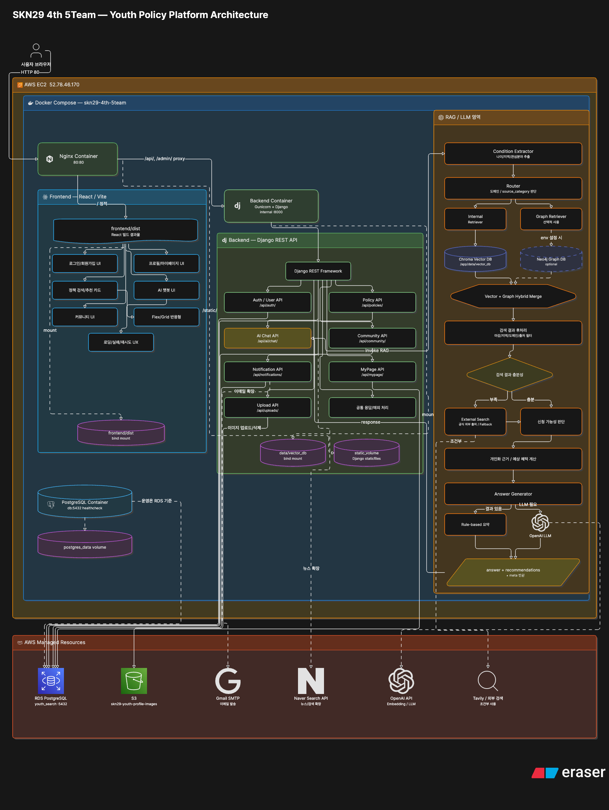
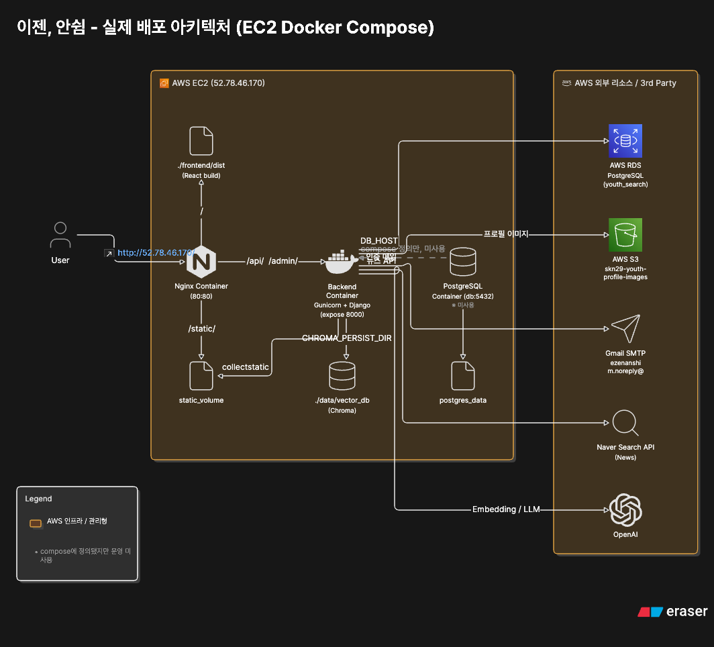
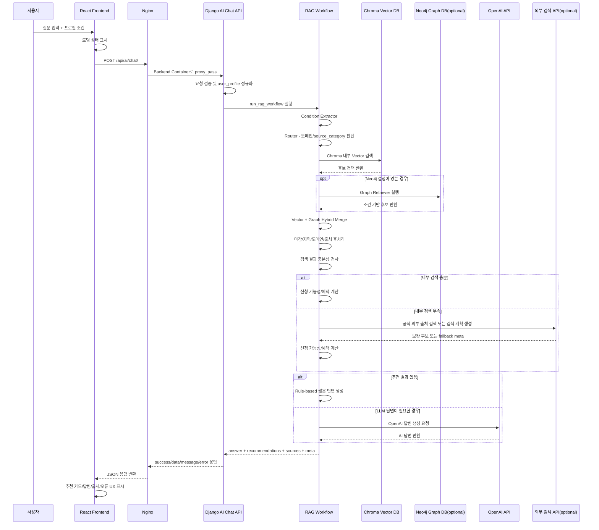

# 평가 기준 대응 시스템 구성도 최종본

## 1. 작성 목적

이 문서는 4차 프로젝트 **이젠, 안쉼**의 실제 GitHub backend 구조와 현재 배포 환경 확인 내용을 반영하여, 평가 기준 중 **시스템 구성도** 항목에 대응하기 위해 작성한 자료다.

기존 구성도는 React, Django, RAG Engine, Chroma Vector DB, PostgreSQL/RDS, OpenAI API, Nginx/Gunicorn 중심의 전체 흐름을 설명했다. 재작성본에서는 다음 내용을 추가로 반영한다.

- EC2 기반 실제 배포 주소 및 HTTP 80 서비스 구조
- Docker Compose 내 `nginx`, `backend`, `db` 컨테이너 구성
- Nginx의 React 정적 파일 서빙 및 `/api/`, `/admin/` reverse proxy 구조
- Gunicorn 기반 Django Backend 실행 구조
- 실제 Django 운영 DB가 AWS RDS PostgreSQL을 바라보는 구조
- Chroma Vector DB의 EC2 host bind mount 유지 구조
- S3 프로필 이미지 업로드 저장소
- Gmail SMTP 이메일 발송 연동 및 Naver Search API 확장 가능 구조
- RAG 내부의 Chroma Vector 검색, 선택적 Neo4j Graph Retriever, Hybrid Merge, 조건부 외부 검색/LLM 호출 구조
- `.env` 환경변수 그룹, 민감도 분리, 보안 점검 체크리스트
- 보안상 개선 필요 지점: HTTPS 미적용, DB 5432 외부 공개 제한 필요, 운영 DEBUG False 전환 필요

---

## 2. 평가 기준 대응 전체 시스템 구성도



---

## 3. 실제 배포 아키텍처 구성도



### 배포 환경 요약

| 구분 | 현재 구성 |
| --- | --- |
| 실제 접속 URL | `http://52.78.46.170/` |
| API URL | `http://52.78.46.170/api/` |
| Admin URL | `http://52.78.46.170/admin/` |
| HTTPS | 현재 미적용 |
| 운영 도메인 | 현재 별도 도메인 없음 |
| Docker 서비스 | `nginx`, `backend`, `db` |
| Nginx 역할 | React/Vite 빌드 결과물 정적 서빙, `/api/`, `/admin/` reverse proxy |
| Backend 실행 | Gunicorn + Django, 내부 8000 포트 |
| 실제 운영 DB | AWS RDS PostgreSQL, DB명 `youth_search` |
| Compose DB | PostgreSQL 컨테이너 포함, healthcheck 통과. 단, 실제 Django 연결은 RDS 기준 |
| Chroma Vector DB | EC2 host `/home/ubuntu/SKN29-4th-5TEAM/data/vector_db` → container `/app/data/vector_db` bind mount |
| S3 | `skn29-youth-profile-images`, 프로필 이미지 업로드 저장소 |
| 외부 API | OpenAI API, Gmail SMTP, Naver Search API(optional), 조건부 외부 검색 API |

---

## 4. 평가 항목별 대응 설명

### 4-1. 전체 데이터 흐름 표현

사용자 요청은 다음 흐름으로 처리된다.

```text
사용자 브라우저
→ Nginx
→ React 정적 화면 제공
→ /api/ 요청 발생
→ Nginx reverse proxy
→ Gunicorn + Django REST API
→ PostgreSQL RDS / Chroma Vector DB / S3 / OpenAI API 연동
→ JSON 응답 반환
→ React에서 카드, 로딩, 오류, 답변 UI로 표시
```

AI 챗봇 요청은 일반 API보다 긴 처리가 필요하므로, 별도의 RAG workflow를 거친다.

```text
AI 질문
→ 조건 추출
→ 도메인/source_category 라우팅
→ Chroma Vector DB 검색
→ 선택적 Neo4j Graph 검색
→ Vector + Graph 후보 병합
→ 마감/지역/도메인/출처 후처리
→ 검색 충분성 검사
→ 신청 가능성/혜택 계산
→ Answer Generator
→ 추천 카드 + 답변 + meta 반환
```

현재 성능 개선 기준에서는 추천 결과가 있는 경우 OpenAI 장문 답변 생성을 매번 호출하지 않고, rule-based 짧은 요약을 우선 반환한다. 이를 통해 AI 챗봇 응답 시간을 줄이고, 정책 상세 설명은 추천 카드 필드에서 확인하도록 분리한다.

---

### 4-2. 배포 아키텍처 표현

배포 구조는 다음과 같다.

```text
외부 사용자
→ AWS EC2 Public IP
→ Nginx Container : 80
→ React/Vite build 정적 파일 서빙
→ /api/, /admin/ 요청은 Backend Container로 proxy_pass
→ Backend Container 내부 Gunicorn
→ Django REST API
→ AWS RDS PostgreSQL / Chroma Vector DB / S3 / OpenAI API
```

Nginx와 Django Backend는 Docker Compose 내부 네트워크 `skn29-4th-5team_default`를 통해 통신한다. Backend 컨테이너는 외부에 직접 공개하지 않고, Nginx를 통해서만 접근하는 구조가 적절하다.

---

### 4-3. 클라우드/컨테이너 구성 표현

현재 Docker Compose에는 다음 서비스가 포함되어 있다.

| 서비스 | 역할 | 외부 포트/내부 포트 |
| --- | --- | --- |
| `nginx` | 프론트 정적 파일 서빙, API reverse proxy | `80:80` |
| `backend` | Gunicorn + Django REST API | 내부 `8000` expose |
| `db` | PostgreSQL 컨테이너, healthcheck 통과 | `5432:5432` |

주요 볼륨/마운트는 다음과 같다.

| 볼륨/마운트 | 역할 |
| --- | --- |
| `static_volume` | Django staticfiles를 Nginx와 공유 |
| `postgres_data` | PostgreSQL 컨테이너 데이터 유지 |
| `./frontend/dist:/app/frontend/dist` | React/Vite 빌드 결과물을 Nginx가 정적 파일로 서빙 |
| `./data/vector_db:/app/data/vector_db` | Chroma Vector DB를 host bind mount로 유지 |

단, 실제 Django Backend의 DB 연결은 compose 내부 `db`가 아니라 AWS RDS PostgreSQL을 바라보는 것으로 확인되었으므로, 구성도에서는 `db container`와 `RDS`의 역할을 분리해 표현한다.

---

### 4-4. 보안/확장성 고려

현재 확인 기준 보안 상태와 권장 개선안은 다음과 같다.

| 항목 | 현재 상태 | 권장 사항 |
| --- | --- | --- |
| HTTP 80 | 공개 | 현재 서비스 접속용 유지 |
| HTTPS 443 | 미적용 | 운영 발표 전후 HTTPS 적용 권장 |
| SSH 22 | 관리자 접속용 | 관리자 IP만 허용 권장 |
| Backend 8000 | compose 내부 expose | 외부 직접 공개 금지, Nginx proxy로만 접근 |
| PostgreSQL 5432 | 현재 외부 공개 확인 | 외부 비공개 또는 EC2/관리자 IP 제한 권장 |
| Secret/API Key | `.env` 또는 compose 환경변수 관리 | GitHub 업로드 금지, 마스킹 문서만 공유 |
| S3 | 프로필 이미지 저장 | 최소 권한 IAM 및 파일 확장자/용량 제한 유지 |
| Chroma Vector DB | EC2 host bind mount | 컨테이너 재생성 후에도 유지 가능, 백업 정책 필요 |

확장성 측면에서는 다음 구조를 추가할 수 있다.

- HTTPS 적용 및 도메인 연결
- RDS 보안 그룹 제한
- Chroma Vector DB 백업/복구 절차 정리
- 정책 데이터 갱신 자동화를 위한 Celery/Redis 추가
- 외부 검색 API를 비동기 작업 또는 제한된 fallback으로 분리
- EC2 단일 서버에서 ECS/EKS 또는 Load Balancer 구조로 확장

---

### 4-5. 환경변수 및 외부 연동 관리 구조

환경변수는 실제 값을 문서에 직접 기록하지 않고, 변수명·용도·민감도·사용 위치만 정리한다. 특히 `SECRET_KEY`, DB 비밀번호, OpenAI Key, AWS Secret Key, Gmail App Password, Naver API Secret 등은 제출 문서와 GitHub에 포함하지 않는다.

| 그룹 | 주요 변수 | 용도 | 민감도 | 문서 반영 방식 |
| --- | --- | --- | --- | --- |
| Django | `DJANGO_SECRET_KEY`, `DJANGO_DEBUG`, `DJANGO_ALLOWED_HOSTS` | Django 보안 키, 운영 모드, 허용 host | HIGH~LOW | 값은 마스킹, 운영에서는 DEBUG False 권장 |
| CORS | `CORS_ALLOWED_ORIGINS` | 프론트 운영 URL 허용 | MEDIUM | 운영 URL 기준으로만 표기 |
| Database | `DB_HOST`, `DB_PORT`, `DB_NAME`, `DB_USER`, `DB_PASSWORD` | AWS RDS PostgreSQL 접속 | HIGH~LOW | RDS endpoint와 비밀번호는 마스킹 |
| PostgreSQL Container | `POSTGRES_DB`, `POSTGRES_USER`, `POSTGRES_PASSWORD` | compose DB 컨테이너 초기 설정 | HIGH~MEDIUM | 실제 운영 DB가 RDS이면 보조 구성으로 표시 |
| OpenAI | `OPENAI_API_KEY`, `OPENAI_EMBEDDING_MODEL` | LLM 답변 생성 및 임베딩 | HIGH~LOW | API Key 미기재, 모델명만 표기 가능 |
| Chroma | `CHROMA_PERSIST_DIR`, `CHROMA_COLLECTION_NAME` | Vector DB 경로와 collection | LOW | `/app/data/vector_db`, `youth_opportunity_chunks` 등 비민감 값만 표기 |
| AWS S3 | `AWS_ACCESS_KEY_ID`, `AWS_SECRET_ACCESS_KEY`, `AWS_STORAGE_BUCKET_NAME`, `AWS_S3_REGION_NAME` | 프로필 이미지 업로드 저장소 | HIGH~LOW | Access/Secret Key 미기재, 버킷명/리전만 표기 가능 |
| Email | `EMAIL_BACKEND`, `EMAIL_HOST`, `EMAIL_PORT`, `EMAIL_USE_TLS`, `EMAIL_HOST_USER`, `EMAIL_HOST_PASSWORD`, `DEFAULT_FROM_EMAIL` | Gmail SMTP 기반 이메일 발송 | HIGH~LOW | 계정/앱 비밀번호는 마스킹 |
| Naver API | `NAVER_CLIENT_ID`, `NAVER_CLIENT_SECRET` | 네이버 검색/뉴스 확장 연동 | HIGH | optional 외부 연동으로 표시, 실제 값 미기재 |
| Policy | `CURRENT_POLICY_YEAR` | 현재 정책 연도 기준 | LOW | 연도 기준값만 표기 가능 |

외부 서비스 연동은 다음과 같이 정리한다.

| 외부 서비스 | 사용 목적 | 현재 구성도 반영 |
| --- | --- | --- |
| OpenAI API | 임베딩 생성, LLM 답변 생성 | RAG/LLM 영역에 포함. 단, 추천 결과가 있으면 rule-based 요약으로 우회 가능 |
| AWS S3 | 프로필 이미지 업로드/삭제 저장소 | Upload API와 연결 |
| Gmail SMTP | 이메일 발송 기능 | Notification/Auth 확장 연동으로 표시 |
| Naver Search API | 뉴스/검색 기능 확장 | optional 외부 검색/뉴스 연동으로 표시 |
| Tavily 또는 공식 외부 검색 API | 내부 검색 부족 시 fallback 후보 검색 | 조건부 사용 또는 검색 계획/fallback으로 표시 |

---

### 4-6. 보안 점검 체크리스트 반영

배포 확인 및 환경변수 점검 결과, 시스템 구성도에는 현재 상태와 개선 권장 사항을 함께 표시하는 것이 안전하다.

| No | 점검 항목 | 현재 확인 내용 | 위험도 | 권장 조치 | 상태 |
| --- | --- | --- | --- | --- | --- |
| 1 | 노출된 Secret/Key 교체 | 터미널 출력 또는 공유 문서에 민감값이 노출될 가능성 있음 | HIGH | AWS/OpenAI/Tavily/Naver/Gmail/DB/Django Secret Key 교체 및 재발급 | 진행전 |
| 2 | DB 5432 외부 공개 차단 | `5432:5432` 포트 매핑 확인 | HIGH | 보안그룹에서 5432 외부 접근 차단, 가능하면 compose `ports` 제거 | 진행전 |
| 3 | 운영 DEBUG 값 변경 | 운영 환경에서 DEBUG True 가능성 확인 | HIGH | 운영 배포에서는 `DJANGO_DEBUG=False` 적용 | 진행전 |
| 4 | HTTPS 적용 | 현재 HTTP 80 기준 | MEDIUM | 도메인 연결 후 443/SSL 적용 검토 | 진행전 |
| 5 | CORS 운영 Origin 정리 | localhost 중심 설정 가능성 있음 | MEDIUM | `CORS_ALLOWED_ORIGINS`를 운영 프론트 URL 기준으로 갱신 | 진행전 |
| 6 | ALLOWED_HOSTS 정리 | IP, localhost, nginx 포함 | MEDIUM | 도메인 적용 시 도메인 추가, 불필요 host 제거 | 진행전 |
| 7 | 환경변수 저장 위치 정리 | compose config 출력 시 실제 값이 노출될 수 있음 | MEDIUM | `.env` git 제외, 서버 파일 권한 제한, 문서에는 변수명만 기록 | 진행전 |
| 8 | Vector DB persistence 확인 | host bind mount로 `/home/ubuntu/.../data/vector_db` 연결 | LOW | 재배포 전후 `chroma.sqlite3` 유지 확인 | 완료 |

평가 발표 시에는 위험 요소를 숨기기보다, **현재 상태와 개선 방향을 분리**해 설명한다. 예를 들어 “현재는 HTTP 80 기반으로 배포되어 있으며, 운영 전환 시 HTTPS와 DB 포트 제한을 적용한다”처럼 표현하면 배포 구조와 보안 고려를 동시에 보여줄 수 있다.

---

## 5. AI 챗봇 상세 처리 흐름도



---

## 6. 주요 API 구성

현재 backend URL 구조는 다음 API 영역으로 구성된다.

| API 영역 | URL Prefix | 역할 |
| --- | --- | --- |
| Auth/User | `/api/auth/` | 회원가입, 로그인, JWT 인증, 사용자 정보 |
| Policies | `/api/policies/` | 정책 목록/검색/상세 조회 |
| Notifications | `/api/notifications/` | 알림 기능 |
| Community | `/api/community/` | 게시글, 댓글, 좋아요 등 커뮤니티 기능 |
| AI Chat | `/api/ai/` | RAG 기반 AI 챗봇 |
| Recommendations | `/api/recommendations/` | 추천 API 확장 영역 |
| News | `/api/news/` | 뉴스 API 확장 영역 |
| MyPage | `/api/mypage/` | 마이페이지/사용자별 정보 |
| Uploads | `/api/uploads/` | 프로필 이미지 업로드/삭제 |
| Admin | `/admin/` | Django Admin |

---

## 7. 평가 발표용 한 장 요약

```text
이젠, 안쉼은 React/Vite 프론트엔드, Nginx, Gunicorn, Django REST API, AWS RDS PostgreSQL, Chroma Vector DB, AWS S3, OpenAI API를 중심으로 구성된 청년 정책 탐색 서비스입니다.

사용자는 EC2 Public IP를 통해 Nginx에 접근합니다. Nginx는 React 빌드 결과물을 정적 파일로 서빙하고, /api/ 및 /admin/ 요청은 Docker Compose 내부의 Gunicorn 기반 Django Backend로 reverse proxy합니다.

Django Backend는 인증, 정책 조회, 커뮤니티, 알림, 마이페이지, 업로드, AI 챗봇 API를 제공합니다. 실제 운영 DB는 AWS RDS PostgreSQL을 사용하며, 프로필 이미지는 AWS S3 버킷에 저장합니다. 이메일 발송은 Gmail SMTP 환경변수로 확장 가능하고, Naver Search API는 뉴스/검색 확장 연동으로 분리 관리합니다.

AI 챗봇은 사용자 질문에서 나이, 지역, 관심 분야를 추출하고, 도메인과 source_category를 라우팅한 뒤 Chroma Vector DB에서 내부 검색을 수행합니다. 선택적으로 Neo4j Graph Retriever 결과를 병합할 수 있으며, 검색 결과에 대해 마감 여부, 지역, 도메인, 출처 기준 후처리를 수행합니다.

추천 결과가 충분한 경우에는 정책 카드와 함께 짧은 rule-based 답변을 반환하여 응답 속도를 개선하고, LLM이 필요한 경우에만 OpenAI API를 호출합니다. 검색 결과가 부족한 경우에는 공식 외부 출처 검색 또는 fallback 안내로 분기합니다.

배포는 Docker Compose 기반이며 nginx, backend, db 컨테이너로 구성됩니다. Chroma Vector DB는 EC2 host 경로를 backend 컨테이너에 bind mount하여 컨테이너 재생성 후에도 데이터가 유지됩니다. 현재 HTTP 80 포트로 서비스 중이며, 운영 안정성을 위해 HTTPS 적용과 DB 5432 포트 외부 비공개 전환이 권장됩니다.
```

---

## 8. 팀원 확인 필요 지점

| 담당 | 확인 필요 사항 |
| --- | --- |
| Frontend | 추천 카드 필드, 로딩/오류 UX, 모바일 반응형 레이아웃 최종 확인 |
| Backend Core | JWT 인증 적용 범위, 공통 응답 구조, 커뮤니티/알림/마이페이지/API 업로드/이메일 설정 정상 동작 확인 |
| AI/RAG | Chroma 경로, OpenAI API Key, rule-based 답변 우회 적용 여부, 외부 검색 on/off 정책 확인 |
| Data/AWS | RDS 연결, S3 업로드, Chroma vector_db 백업, 보안그룹 5432 제한 여부, HTTPS/도메인 적용 여부 확인 |
| PM/QA | 평가 시나리오, 발표용 문구, 신청 가능성 표현의 안전성 검토 |

---

## 9. 현재 기준 주의 사항

- HTTPS는 현재 미적용 상태이므로 운영 안정성 관점에서는 443 적용 예정으로 표현한다.
- DB 5432 포트가 현재 외부 공개 상태로 확인되었으므로, 구성도에는 현재 상태와 함께 비공개 전환 권장을 명시한다.
- Docker Compose에는 `db` 컨테이너가 포함되어 있으나, 실제 Django 운영 DB 연결은 AWS RDS PostgreSQL 기준으로 설명한다.
- React는 별도 frontend 컨테이너가 아니라, `frontend/dist` 빌드 결과물을 Nginx가 정적 파일로 서빙하는 구조로 표현한다.
- Chroma Vector DB는 backend 컨테이너 내부 생성물이 아니라 EC2 host bind mount로 유지된다.
- Redis/Celery는 현재 docker-compose에 포함되어 있지 않으므로, 구성도 본 흐름에는 넣지 않고 향후 확장 항목으로만 언급한다.
- OpenAI API는 RAG Embedding/LLM 호출에 사용되지만, 성능 개선 적용 기준에서는 추천 결과가 있는 경우 rule-based 요약으로 우선 응답할 수 있다.
- Gmail SMTP와 Naver Search API는 환경변수에 포함된 외부 연동 항목이므로, 구성도에는 optional 외부 서비스로 표시하되 실제 키 값은 문서에 포함하지 않는다.
- `.env` 원문 또는 compose config 출력 결과는 민감값을 포함할 수 있으므로 제출용 문서에는 변수명, 용도, 민감도, 마스킹 예시만 남긴다.
- 민감값 노출 가능성이 확인된 경우 OpenAI, AWS, Naver, Gmail, DB, Django Secret Key는 교체 또는 재발급을 권장한다.
- Neo4j Graph Retriever는 환경변수와 연결 가능 여부에 따라 선택적으로 동작하는 optional 구성으로 표시한다.
