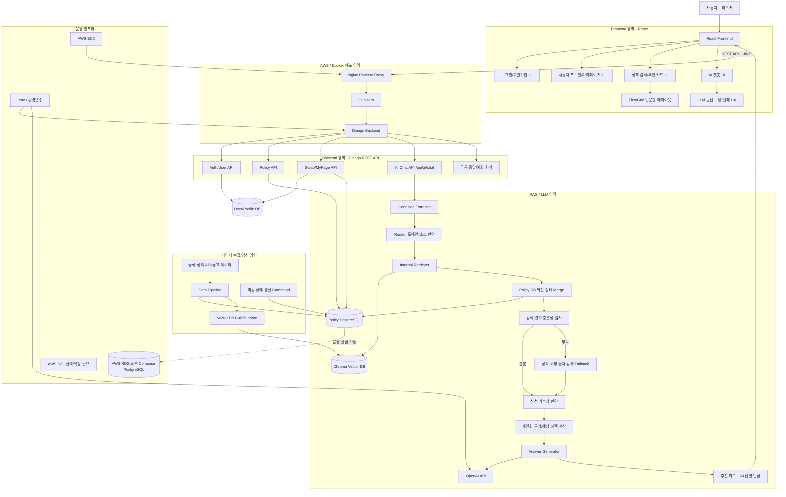
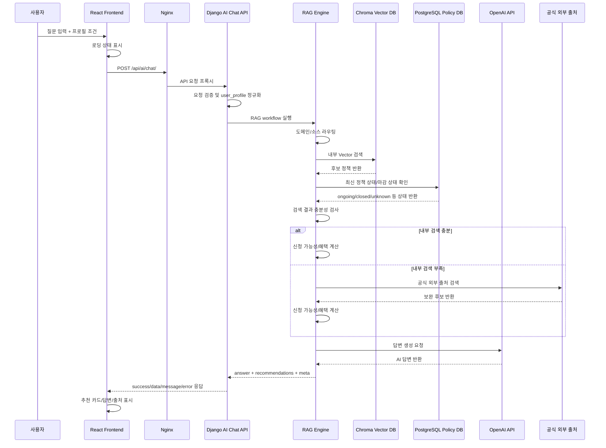

# 평가 기준 대응 시스템 구성도

## 1. 작성 목적

이 문서는 4차 프로젝트 **이젠, 안쉼**의 시스템 구성을 평가 기준에 맞춰 설명하기 위한 자료다.

기존 6-8 문서에서는 React, Django, RAG Engine, Chroma Vector DB, OpenAI API, Nginx/Gunicorn 배포 흐름을 중심으로 전체 시스템 구조를 정리했다. 본 문서는 그 구조를 평가 항목에 직접 대응되도록 재구성한다.

평가 대응 관점의 핵심은 다음 네 가지다.

| 평가 대응 항목 | 시스템에서 보여줘야 하는 요소 |
| --- | --- |
| 인증·권한 체계 | JWT 로그인, 사용자 프로필, 스크랩/마이페이지, 권한 기반 API |
| 비동기 LLM 연동 및 UX 처리 | AI 챗봇 API, 로딩/실패 처리, fallback, 에러 코드 |
| Flex/Grid 기반 반응형 UI | React 화면, 추천 카드, 신청 가능성 뱃지, 혜택 카드 |
| AWS/Docker 배포 환경 | Nginx, Gunicorn, Django, PostgreSQL/RDS, Chroma Volume, EC2/S3 |

---

## 2. 평가 기준 대응 전체 시스템 구성도



---

## 3. 평가 항목별 설명

### 3-1. 인증·권한 체계 대응

인증·권한 평가는 단순히 로그인 화면이 있는지보다, 사용자 정보가 서비스 흐름에 실제로 연결되는지가 중요하다.

본 시스템에서는 다음 구조로 대응한다.

```text
React 로그인/회원가입 UI
→ Django Auth/User API
→ JWT 발급 및 인증 처리
→ 사용자 프로필 저장
→ AI 챗봇 요청 시 user_profile 반영
→ 스크랩/마이페이지에서 사용자별 데이터 조회
```

평가에서 강조할 수 있는 포인트는 다음과 같다.

- JWT 기반 로그인/인증 흐름
- 사용자별 프로필 관리
- 사용자 조건이 AI 추천에 반영되는 구조
- 스크랩/마이페이지 등 사용자별 권한 데이터 분리

---

### 3-2. 비동기 LLM 연동 및 UX 처리 대응

AI 챗봇 요청은 사용자의 질문을 받은 뒤 내부 검색, 충분성 검사, 외부 fallback, LLM 답변 생성을 거치므로 일반 API보다 응답 시간이 길 수 있다.

이를 고려해 시스템은 다음 구조로 대응한다.

```text
React Chat UI
→ 로딩 상태 표시
→ /api/ai/chat/ 요청
→ Django 요청 검증
→ RAG 검색
→ OpenAI API 호출
→ 성공 시 추천 카드와 답변 표시
→ 실패 시 error.code 기준으로 사용자 안내
```

AI 응답은 항상 다음 공통 구조를 유지한다.

```json
{
  "success": true,
  "data": {
    "answer": "...",
    "recommendations": [],
    "sources": [],
    "warnings": [],
    "error": null,
    "meta": {}
  },
  "message": "AI 응답 생성 성공",
  "error": null
}
```

실패 시에도 `success / data / message / error` 구조를 유지하므로, 프론트에서는 다음 기준으로 UX를 분기할 수 있다.

```text
EMPTY_MESSAGE       → 질문 입력 안내
INVALID_TOP_K       → 요청값 오류 안내
LLM_TIMEOUT         → 잠시 후 재시도 안내
LLM_RATE_LIMIT      → 사용량 제한 안내
VECTOR_DB_ERROR     → 검색 시스템 오류 안내
AI_SERVICE_ERROR    → 일반 AI 서비스 오류 안내
```

평가에서 강조할 수 있는 포인트는 다음과 같다.

- LLM 응답 지연을 고려한 로딩 UX
- AI 오류 코드 기반 실패 처리
- 내부 검색 부족 시 공식 외부 출처 fallback
- 추천 결과와 출처를 함께 반환하는 신뢰성 구조

---

### 3-3. Flex/Grid 기반 반응형 UI 대응

프론트엔드는 React 기반으로 구성되며, 정책 추천 결과는 카드 UI로 표시한다.

AI API는 프론트 카드에 바로 사용할 수 있는 필드를 제공한다.

```text
title
display_summary
display_period
badges
action_url
has_detail_url
personalized_reason
eligibility_badge_text
eligibility_badge_type
eligibility_check_items
max_total_benefit_text
benefit_calculation_text
```

반응형 UI 기준으로는 다음 구조가 적절하다.

```text
Desktop
- 정책 카드 2~3열 Grid
- AI 챗봇과 추천 결과 영역 분리

Tablet
- 정책 카드 2열 Grid
- 상세 정보는 접힘/펼침 처리

Mobile
- 정책 카드 1열
- 신청 가능성, 예상 혜택, 버튼을 우선 노출
```

평가에서 강조할 수 있는 포인트는 다음과 같다.

- React 기반 컴포넌트 분리
- Flex/Grid 기반 정책 카드 레이아웃
- AI 응답 상태에 따른 로딩/오류/결과 화면 분기
- 신청 가능성/예상 혜택을 시각적으로 확인 가능한 UX

---

### 3-4. AWS/Docker 배포 환경 대응

현재 배포 구조는 Docker Compose 기준으로 Nginx, Django Backend, PostgreSQL을 중심으로 구성된다.

```text
외부 사용자
→ Nginx Container : 80/443
→ Django Backend Container : 8000
→ PostgreSQL 또는 RDS : 5432
→ Chroma Vector DB Volume : /app/data/vector_db
→ OpenAI API / 외부 공식 출처
```

운영 환경에서는 다음 보안 구조를 권장한다.

| 구분 | 포트 | 공개 여부 |
| --- | --- | --- |
| HTTP | 80 | 외부 공개 |
| HTTPS | 443 | 외부 공개 |
| SSH | 22 | 관리자 IP만 허용 |
| Django | 8000 | 외부 직접 공개 비권장 |
| PostgreSQL | 5432 | 외부 직접 공개 비권장 |

평가에서 강조할 수 있는 포인트는 다음과 같다.

- Nginx + Gunicorn + Django 구조
- Docker Compose 기반 실행
- EC2 배포 가능 구조
- RDS/S3 확장 가능성
- API Key와 DB 비밀번호를 환경변수로 관리
- 8000/5432 외부 직접 공개 차단 권장

---

## 4. AI 챗봇 상세 처리 흐름도



---

## 5. 평가 발표용 한 장 요약

```text
이젠, 안쉼의 시스템은 React 프론트엔드, Django REST API, RAG 기반 AI 챗봇, Chroma Vector DB, PostgreSQL, OpenAI API, Nginx/Gunicorn 배포 구조로 구성됩니다.

사용자는 React 화면에서 로그인 후 프로필을 입력하거나 AI 챗봇에 질문할 수 있습니다. Django 백엔드는 인증, 정책 조회, 스크랩, AI 챗봇 API를 제공하고, AI 챗봇 요청은 RAG Engine으로 전달됩니다.

RAG Engine은 사용자 조건을 정규화하고, 도메인 라우팅 후 Chroma Vector DB에서 내부 검색을 수행합니다. 검색 결과가 충분하면 내부 데이터 기반으로 답변을 생성하고, 부족하면 공식 외부 출처 검색으로 보완합니다.

최종 응답은 추천 정책 카드에서 바로 사용할 수 있도록 신청 가능성, 개인화 추천 이유, 예상 혜택, 출처 URL을 포함합니다.

배포는 Docker Compose 기반으로 Nginx, Gunicorn, Django, PostgreSQL을 연결하는 구조이며, 운영 환경에서는 EC2, RDS, S3, HTTPS 적용을 확장할 수 있습니다.
```

---

## 6. 팀원 확인 필요 지점

| 담당 | 확인 필요 사항 |
| --- | --- |
| Frontend | 추천 카드에서 사용할 필드, 로딩/오류 UX, 버튼 링크 우선순위 |
| Backend Core | JWT 인증 적용 범위, 공통 응답 구조, `/api/ai/chat/` URL 유지 여부 |
| Data/AWS | Chroma Vector DB 경로, OpenAI API Key, RDS/S3 사용 여부, 보안 그룹 |
| PM/QA | 평가 시나리오, 발표용 문구, 신청 가능성 표현의 안전성 |

---

## 7. 현재 기준 주의 사항

- `UserProfile.INTEREST_CHOICES`는 공식 정책 도메인 기준으로 정리하는 것이 안전하다.
- RAG 내부에서는 금융/창업을 alias 또는 확장 라우팅 키워드로 처리할 수 있다.
- `참여기반`과 `참여권리`는 `참여권리`로 통일하는 것이 안전하다.
- Django Policy 모델의 마감 상태 기준이 `upcoming / ongoing / closing_soon / closed / unknown`이라면, AI/RAG의 기존 `open / expired / unknown` 값은 alias로만 처리하고 최종 응답은 Django 기준으로 통일하는 것이 좋다.
- 마감 상태 변경만으로는 Vector DB 전체 재임베딩이 필요하지 않으며, 검색 후 PostgreSQL 최신 상태를 merge하는 방식이 안전하다.
